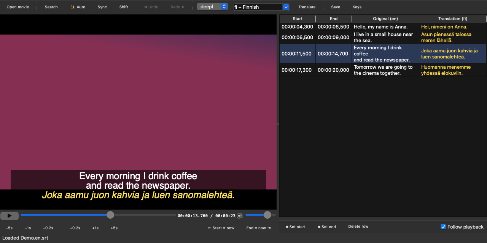

<div align="center">


# Subtitle Tool

**Subtitles for language learning: find them, sync them, or make them from the audio,
then read the original and your language together.**

[](https://github.com/amarald-org/subtitle-tool/releases/latest)

[](LICENSE)
[](https://buymeacoffee.com/aaroq)



</div>

## What it does

- 🔎 **Find** subtitles for a movie on OpenSubtitles (by file fingerprint and title).
- 🎯 **Sync** them to the movie's audio, so they're on time even when they came from another release.
- ✨ **Make** subtitles from the audio with Whisper, on your own computer (no upload, no key).
  Works for your own videos, YouTube downloads and songs.
- 🌍 **Translate** to Finnish or any other language (DeepL or Google).
- 📚 **Show both** languages at once: the original in white, the translation in yellow underneath.
- ✏️ **Edit** everything in a simple player: fix lines, retime them, or write subtitles by hand.

Everything is saved as normal `.srt` / `.ass` files next to the video, so any player
(VLC, IINA, mpv, Plex…) can show them.

## Download

Grab the app for your system from **[Releases](https://github.com/amarald-org/subtitle-tool/releases/latest)**:

| System | File |
| --- | --- |
| macOS (Apple Silicon) | `Subtitle-Tool-…-macOS-arm64.dmg` |
| Windows (64-bit) | `Subtitle-Tool-…-Windows-x64.zip` |
| Linux (x86_64) | `Subtitle-Tool-…-Linux-x86_64.AppImage` |

> **First launch:** the builds aren't signed yet. On **macOS** right-click the app › **Open**.
> On **Windows** SmartScreen: **More info › Run anyway**. On **Linux** `chmod +x` the AppImage.

## Using the editor

Open a video. Subtitles already next to it (`movie.srt`, `movie.en.srt`, `movie.fi.srt`) load
automatically. Otherwise:

| | |
| --- | --- |
| ✨ **Auto** | Listens to the audio and writes subtitles with timestamps; the list fills in as it goes, translated if you like |
| **Search** | Find subtitles online, then **Sync** to match them to the audio |
| **⏺ Set start / ⏹ Set end** | Write your own: start a line at the current moment, type it, end it |
| **⇤ Start = now / End = now ⇥** | Retime the selected line to the current moment |
| **Translate** | Fill empty translation cells (clear a cell to re-translate that line) |
| **Keys…** | DeepL, OpenSubtitles and Hugging Face keys, remembered by the app |

Click a start or end time to jump there. Double-click a line to edit it
(Enter saves, Shift+Enter adds a line break).

**Shortcuts** (⌘ on macOS, Ctrl on Windows/Linux)

| Keys | Action |
| --- | --- |
| Space | Play / pause |
| ⌘J / ⌘L | Back / forward 1 s |
| ⌘⇧J / ⌘⇧L | Back / forward 5 s |
| ⌘⌥J / ⌘⌥L | Back / forward 0.2 s |
| ⌘B / ⌘E | Set start (new line) / set end |
| ⌘⇧B / ⌘⇧E | Selected line: start = now / end = now |
| ⌘Z / ⌘Y | Undo / redo |
| ⌘S | Save |
| Delete | Remove selected lines |

## API keys (free)

| Key | Needed for | Get it |
| --- | --- | --- |
| DeepL | Translation (best quality; free plan ≈ 500 000 characters/month) | [deepl.com/pro-api](https://www.deepl.com/pro-api) |
| OpenSubtitles | Searching subtitles online | [opensubtitles.com/consumers](https://www.opensubtitles.com/consumers) |
| Hugging Face | Optional, faster Whisper model downloads | [huggingface.co/settings/tokens](https://huggingface.co/settings/tokens) |

Enter them in the app under **Keys…**, or as environment variables
(`DEEPL_API_KEY`, `OPENSUBTITLES_API_KEY`, `HF_TOKEN`). Whisper and syncing need no key.

## Whisper models

The first **Auto** downloads a speech model once (shown with progress and speed):

| Model | Size | |
| --- | --- | --- |
| tiny / base | 75 / 145 MB | fast, rough |
| small | 480 MB | good default |
| medium | 1.5 GB | better |
| large-v3-turbo | 1.6 GB | best |

Remove them any time from **Auto › Manage downloads…**, or `subtitle-tool models --delete large-v3-turbo`.
They live in `~/.cache/huggingface/hub`.

**Songs:** tick *Song / music video* in the Auto window. Whisper normally skips parts without
speech, which can also skip singing over music; this keeps them. Clear vocals work well;
very loud mixes may miss or invent words.

## Command line

The same features without the window. Install with [uv](https://docs.astral.sh/uv/):

```sh
git clone https://github.com/amarald-org/subtitle-tool && cd subtitle-tool
./install.sh                     # Windows: powershell -ExecutionPolicy ByPass -File .\install.ps1
```

```sh
subtitle-tool movie.mkv                      # find + sync English subtitles
subtitle-tool movie.mkv -t                   # … and add Finnish, plus dual-language files
subtitle-tool video.webm --auto -t           # transcribe with Whisper, then translate
subtitle-tool song.mp3 --auto -t --music     # tuned for songs
subtitle-tool movie.mkv -t --target sv       # another language
subtitle-tool gui movie.mkv                  # open the editor
subtitle-tool models                         # list / delete Whisper models
```

The downloaded app has the same command line: `"Subtitle Tool" --cli movie.mkv --auto -t`.

Output files, next to the video:

| File | Contents |
| --- | --- |
| `movie.en.srt` | Original language |
| `movie.fi.srt` | Translation only |
| `movie.en-fi.srt` | Both, translation in yellow italics |
| `movie.en-fi.ass` | Both, styled (best in VLC / mpv / IINA) |

## How it works

[faster-whisper](https://github.com/SYSTRAN/faster-whisper) for transcription,
[ffsubsync](https://github.com/smacke/ffsubsync) + webrtcvad for syncing,
[PyAV](https://github.com/PyAV-Org/PyAV) for audio,
[Qt for Python](https://doc.qt.io/qtforpython/) for the player (FFmpeg built in),
DeepL / Google for translation, OpenSubtitles for search.
Building the apps yourself: `packaging/build_app.sh`.

## Support

Subtitle Tool is free and open source. If it helps you learn a language,
you can [buy me a coffee](https://buymeacoffee.com/aaroq) ☕

MIT licensed. Movies are never downloaded by this tool.
